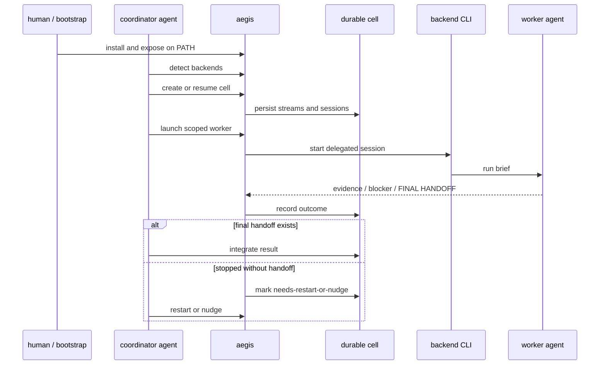

# Aegis

> **A local coordination substrate for agents that manage other agents.**

Aegis is not a human-operated CLI product.

Humans install it. Agents use it.

```text
coordinator agent
      |
      |  aegis
      v
 durable cell state  <---->  worker sessions
      |                         |
      v                         v
 evidence / blockers / final handoffs / recovery signals
```

## What it gives agents

| Capability | What agents get |
|---|---|
| **Delegation** | Launch worker sessions through OpenCode, Codex, Pi, or GitHub Copilot CLI. |
| **Final handoffs** | Require a bounded `FINAL HANDOFF` instead of scraping full transcripts. |
| **Durable cells** | Persist streams, clone paths, sessions, evidence, blockers, verification, and integration notes. |
| **Recovery signals** | Mark stopped sessions without handoff as `needs-restart-or-nudge`, not `blocked`. |
| **Recursive fan-out** | Let worker agents split assigned work into child cells when needed. |
| **Backend boundaries** | Keep coordination state separate from backend transport, ready for future server/MCP shapes. |

## Coordination flow



## Core contracts

- **Session records** preserve backend ids, status, prompt metadata, summaries, and message pointers.
- **Cell records** preserve recursive coordination state across independent agent processes.
- **Final handoff extraction** gives coordinator agents a bounded summary contract.
- **Backend detection** reports local command availability only. Live backend behavior still needs smoke verification.
- **Generated state** stays outside target repos unless intentionally committed as a fixture.

## Docs

| Need | Go to |
|---|---|
| Agent command forms and output contracts | [Agent command contract](./docs/agent-command-contract.md) |
| Source layout and contribution rules | [Contributing](./CONTRIBUTING.md) |
| Backend verification standard | [Live backend smoke](./docs/live-backend-smoke.md) |
| In-process .NET agent hosts | [Package consumption](./docs/package-consumption.md) |
| Backend parity and rollout notes | [Multi-backend rollout](./docs/multi-backend-rollout.md) |

## Repository map

| Path | Role |
|---|---|
| `src/Aegis/` | Command surface agents invoke. |
| `src/Aegis.Core/` | Shared contracts, registries, state normalization, prompt rendering. |
| `src/Aegis.Backends/` | Backend adapters for OpenCode, Codex, Pi, and GitHub Copilot CLI. |
| `src/Aegis/CellUi/` | Optional read-only observer for cell records. |
| `prompts/` | Built-in worker and delegation prompt templates. |
| `support/vscode/` | VS Code Copilot Chat agent/instruction/prompt templates. |
| `tests/` | Unit and integration coverage for agent/session behavior. |

## Build and install

The README stays focused on the capability model.

Install and build details live in the [agent command contract](./docs/agent-command-contract.md) and [contributing guide](./CONTRIBUTING.md). The repo-level contract is simple: installing Aegis makes an `aegis` command available to agents.

## License

[MIT](./LICENSE)
